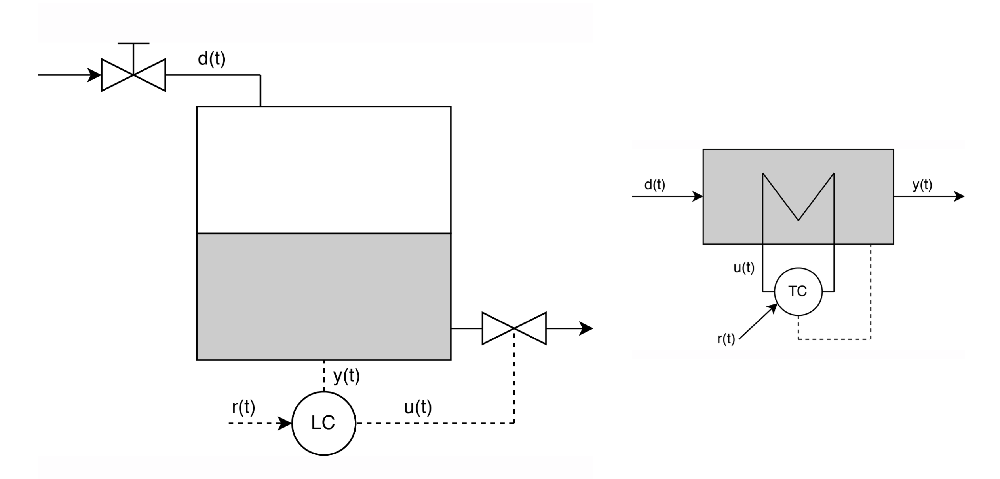

# Reinforcement-Learning-PID-controller
This repo contains an implementation of a Reinforcement Learning agent used as an alternative for a classic PID process controller and was created in the context of a project assignment for the course "Reinforcement Learning" at the Vrije Universiteit Brussel.

## Introduction:

The purpose of the repo is to test the agent’s capability of learning to control two basic and common process applications in order to compare the RL-agent with a PID controller, set to control these same two control applications.

The two implemented environments are a cylindrical liquid tank level control and a basic air heater system. Two setups which are commonplace in classical control theory.

## Implementation details and results:
The code was implemented in Python and PyTorch and a requirements.txt is included in the repo. The training and evaluation of the agents can be executed by means of the files:

* [train_heater_scenario.py](./train_heater_scenario.py)
* [train_tank_scenario.py](./train_heater_scenario.py)
* [eval_heater_scenario.py](./eval_heater_scenario.py)
* [eval_tank_scenario.py](./eval_heater_scenario.py)

For an extensive description of the implementation details and results, please consult the [report](./report.pdf) included in the repo. 
